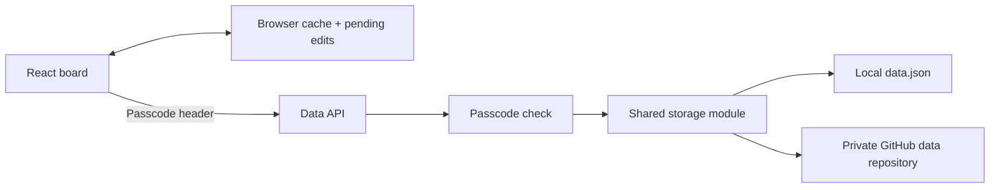

# Roadmap · Personal Planning Board

**A self-hosted planning app with drag-and-drop tracks, offline edits, and GitHub-backed version history.**

Organize goals into tracks and phases, track progress, and capture ideas in a scratch pad. The app works with a local JSON file during development and can save to a private GitHub repository when deployed.

**Stack:** React · JavaScript · Vite · dnd-kit · Progressive Web App · GitHub Contents API

## What it demonstrates

- **Interactive planning:** draggable items, editable tracks and phases, status filters, due dates, and notes.
- **State management:** undo/redo, keyboard shortcuts, search, and a categorized scratch pad.
- **Offline behavior:** a cached app shell and browser-local data let an already-loaded board open offline and queue edits for reconnection.
- **Versioned persistence:** each successful debounced save to GitHub creates a commit in a separate data repository.
- **Access control:** a shared passcode gates the API when configured, with server-side GitHub credentials.
- **Storage diagnostics:** the app reports configuration and connection problems instead of silently replacing saved data.

## Why use GitHub for storage?

A single person's roadmap is small enough to store as JSON. The GitHub Contents API provides a version history without running a separate database. Local development uses the same storage interface with a file on disk.

The tradeoff is write latency and commit volume. Saves are debounced, and concurrent/offline edits do not receive a multi-user merge: a later save can replace another device's changes. This is a personal tool.

## Architecture



**Start reading:** [board and save lifecycle](src/App.jsx) · [client cache and API](src/api.js) · [storage implementation](lib/store.js) · [serverless endpoint](api/data.js)

## Run locally

Use Node.js 22.12+ and npm:

```sh
git clone https://github.com/alimleahat/personal-roadmap-organization-tool.git
cd personal-roadmap-organization-tool
npm ci
npm run dev
```

Open `http://localhost:5173`. With no GitHub environment variables or passcode configured, the development API uses a local `data.json` file. That file is ignored by Git.

Edit [`src/config.js`](src/config.js) for the header name and period. Use **Settings** in the app to configure tracks and phases. Built-in sample content lives in [`src/constants.js`](src/constants.js).

## Deploy with private GitHub storage

### 1. Prepare a data repository

Create a separate **private** repository for your roadmap data, with an initialized default branch, such as `main`. Keep personal `data.json` out of this public source repository.

### 2. Create a scoped token

Create a fine-grained GitHub token with access to that data repository and **Contents: read and write**. The token must explicitly include the private repository; public-only access will not work.

### 3. Configure the deployment

Import this source repository into Vercel. The included [`vercel.json`](vercel.json) configures the Vite build and API routing. Set these server-side environment variables:

- `GITHUB_TOKEN`: the scoped data-repository token.
- `GITHUB_OWNER`: your GitHub username or organization.
- `GITHUB_REPO`: the private data repository name.
- `GITHUB_BRANCH`: its initialized default branch.
- `ROADMAP_PASSCODE`: a separate, strong passcode for this app.
- `DATA_PATH`: optional repository file path; defaults to `data.json`.

**Set `ROADMAP_PASSCODE` before exposing a deployment.** The current code permits requests when it is unset, including on a deployed server. This is a configuration requirement, not an automatically enforced production check.

Redeploy after changing environment variables. See [`.env.example`](.env.example) for the same settings in local development. GitHub credentials belong on the server, never in a `VITE_` variable.

The included deployment configuration targets Vercel. Other hosts need an adapter for the API handler and persistent GitHub storage; a static-only host does not provide `/api/data`.

### 4. Install as an app

After loading the deployed HTTPS site, use **Add to Home Screen** in iOS Safari or **Install app** in a supported Android browser. Offline installation and caching apply to the production PWA build; the Vite development server does not enable the service worker.

## Data handling

- Opening the page does not itself trigger a save.
- Failed loads with no usable cache disable editing instead of overwriting remote data.
- Pending offline edits are stored in the browser and retried on reconnect.
- Each successful remote save appears in your data repository's commit history.
- `npm run backup` copies the **local** `data.json` to a timestamped file in `backups/`. It does not fetch a remote GitHub backup.

Browser-local data remains on the device. The passcode protects API requests; it does not encrypt saved roadmap content.

## Build and checks

```sh
npm run build
npm run lint
```

The production build passes and generates the PWA assets. The existing lint command currently reports state synchronization issues in `App.jsx` and `DetailModal.jsx`, plus an unused parameter in `SettingsModal.jsx`; these are documented follow-up work. No automated application test suite is configured.

`npm run preview` previews the built frontend only. The development data middleware runs with `npm run dev`; a complete production instance needs the deployed API.

## Repository layout

```text
src/components/    Board cards, filters, dialogs, scratch pad, and settings
src/App.jsx        Board state, interaction, undo/redo, and save lifecycle
src/api.js         Browser cache, pending edits, and API requests
lib/               Shared storage and passcode logic
api/data.js        Vercel serverless endpoint
public/            App icons and static assets
vite.config.js     Local API middleware and PWA configuration
.env.example       Documented server environment variables
```

## License

[MIT](LICENSE) · Ali Mleahat
